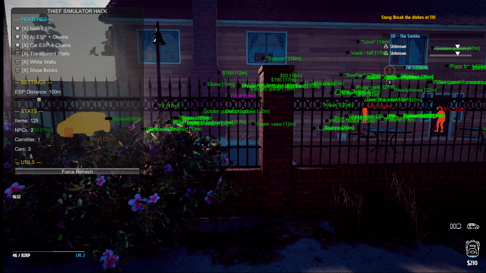

# Byakugan - Thief Simulator ESP

> "See through all obstructions and deceptions."

**Byakugan** is a comprehensive ESP and visualization tool for **Thief Simulator**, designed to aid in game mechanics exploration and analysis. This tool grants the user enhanced visual perception, allowing you to track items, NPCs, and structural elements through walls.



## 👁️ Features

- **Item ESP**: Identify and locate valuable loot, quest items, and tools across the map.
  - Distinguishes between cash 💵, tools 🔧, keys 🔑, and large items 📦.
- **AI & Security Vision**: Track NPC movements and security camera cones in real-time.
  - Includes **Chams** (visible-through-walls shaders) for NPCs and Vehicles.
- **Structure Analysis**:
  - **White Walls**: Converts textures to flat white for easier lighting analysis.
  - **Transparent Walls**: Adjust wall opacity to see building interiors from outside.
- **Car ESP**: Locate your getaway vehicle instantly.

## 🛠️ Compatibility

Tested and working on **Thief Simulator Build 21239852** (Steam Release).
[View Patch Notes](https://steamdb.info/patchnotes/21239852/)

## 🚀 Installation & Usage

This mod is a C# Assembly that must be injected into the game's Mono runtime. We recommend using [SharpMonoInjector](https://github.com/warbler/SharpMonoInjector).

### Steps:
1.  **Launch Thief Simulator** and load into a game.
2.  Open a terminal (PowerShell or CMD) in the folder containing `SharpMonoInjector.dll` / `SharpMonoInjector.exe` (Console version).
3.  Run the following injection command:

```powershell
.\SharpMonoInjector.Console.exe inject -p "Thief Simulator" -a "path\to\ThiefSimulatorHack.dll" -n ThiefSimulatorHack -c Loader -m Init
```

**Arguments Explained:**
- `-p "Thief Simulator"`: The process name of the game.
- `-a "..."`: Absolute path to the compiled `ThiefSimulatorHack.dll`.
- `-n ThiefSimulatorHack`: The namespace of the mod.
- `-c Loader`: The class to initialize.
- `-m Init`: The method to call on start.

4.  **Success!** Press **INSERT** to open the `BYAKUGAN` menu.

## �️ Roadmap / TODO

- [ ] Add trigger zone visualization for security cameras.
- [ ] Implement Police ESP (highlighted in blue).
- [ ] Replace `CCTVCameraObject` and `SpyCameraObject` ESP with a more unified `HintedObject` system.
- [ ] Refine Chams application logic and wireframe rendering for NPCs/Vehicles.
- [ ] Add persistence for features toggled via checkboxes.

## �👥 Contributors

- **Antigravity** - *Lead Architect & Visionary*

## 📜 License

This project is licensed under the MIT License - see the [LICENSE](LICENSE) file for details.

## ⚠️ Disclaimer
This software is intended for offline, single-player game exploration and educational purposes.
